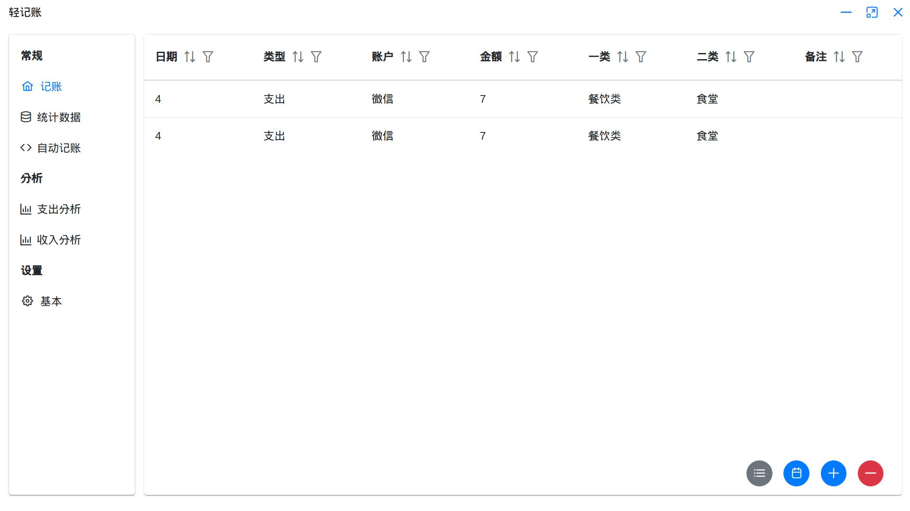

</img>

<h2 align="center">轻记账</h2>

个人资产管理软件

一个简易的永久免费的记账软件，针对普通用户，界面简单，无需专业的会计知识！

# 功能

- [x] 基本的收入、支出、转账记录
- [x] 自定义支出，收入类型
- [x] 账单排序、检索
- [x] 多账户管理
- [x] 支出，收入图表分析
- [x] 自动记账脚本
- [ ] 自定义账户图标
- [ ] 云同步

# 截图

# 贡献

如果有需要的功能或对当前功能的修改建议，欢迎提交issues。

如果想提供实现具体功能的代码，欢迎提交pull request。

# 依赖

[electron-vue-vite](https://github.com/caoxiemeihao/electron-vite-vue)

[data-forge](http://www.data-forge-js.com/)

[primeVue](https://primefaces.org/primevue/#/)

[简约icon图标生成器（图标生成）](https://tools.kalvinbg.cn/convenience/icon)

# LICENSE

[MIT](./LICENSE)